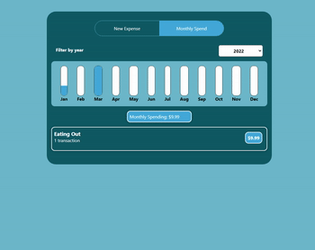
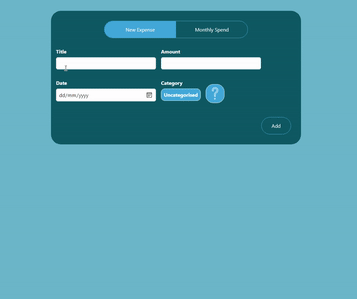

# Description
Short project to apply basic React, Javascript and CSS programming skills gained from [Maximilian Schwarzmuller's Udemy course](https://www.udemy.com/course/react-the-complete-guide-incl-redux/).

Idea was loosely based on Commonwealth Bank's monthly cash flow and spend categories features. 

 

## Design Logic and Choices
When building this project from scratch, my main focus was to separate as much logic as I could into independent class components. This allowed me to be able to reuse recurring components (see Button.js and Card.js in the UI folder), as well as break down and isolate functionality to make it easier to visualise what I wanted everything to look like. 

There was also no particular reason why I have both CSS and CSS modules, other than learning about the latter in the middle of building the project. For something small-scale like this, majority of the benefits that come from CSS modules become redundant, but nonetheless, was a good time to get comfortable with using them.

A particular design choice I wanted to highlight is seen in Tab.js, where <NewExpenseTab/> and <MonthlyExpenseTab/> are rendered. Since both depend on the state of 'expenses', but <NewExpenseTab/> is where new expenses are submitted, it made sense to lift up the 'expenses' state to <Tab/>, their common ancestor component. Then, using props, I pass down the "addExpenseHandler" function to <NewExpenseTab/> and the record of expenses to <MonthlyExpenseTab/> such that they can be displayed.

When trying to filter expenses by month, I applied the useContext hook (see ExpensesList.js & MonthlyExpenseTab.js in the Tabs subfolder). I recognised that within the DOM tree, as I needed to receive the selected month in <ExpensesChart/>, push it up to <MonthlyExpenseTab/>, then hand it down to <ExpensesList/>, it was easier to just use a Context object with the useContext hook. I did not apply useContext with some functions that are 'prop drilled' (e.g. monthChangeHandler in MonthExpenseTab.js is passed thrice before being used) because these functions were not used outside the small selection of child components (i.e. not used globally and by many other components), so it seemed unnecessary. 

# It works!
 

Having multiple expenses:

Error-Handling:

# Credits
Tab creation was based on [this guide](https://blog.logrocket.com/how-to-build-tab-component-react/).

A part of the drop down menu code (DropDown.js) was based on [this video](https://www.youtube.com/watch?v=IF6k0uZuypA).
